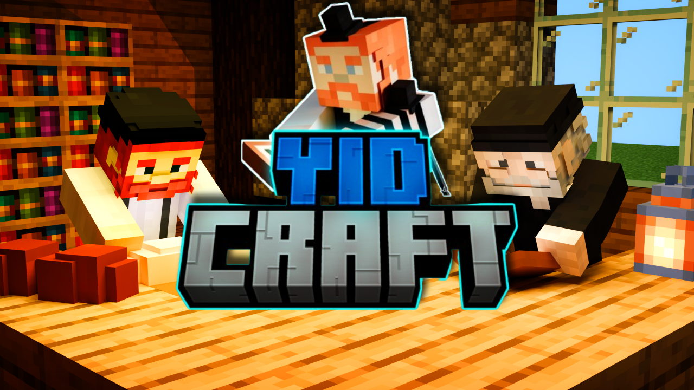

import MinecraftSkin from "../../components/MinecraftSkin.astro";
import "../../styles/yidcraft-home.css";

## Meet the Staff

  

    

      <MinecraftSkin username="Chokitu" />

      <strong>Chokitu</strong>
      Director
    

    

      <MinecraftSkin username="MrWeissberg" />

      <strong>MrWeissberg</strong>

      Director

    

  

  

    

      <MinecraftSkin username="Yyp987" />

      <strong>Yyp987 (Chicken)</strong>
      Admin
    

    

      <MinecraftSkin username="ChabadChosid" />

      <strong>ChabadChosid</strong>
      Admin
    

    

      

      <strong>Sneaky Snack</strong>
      Artist

    

  

